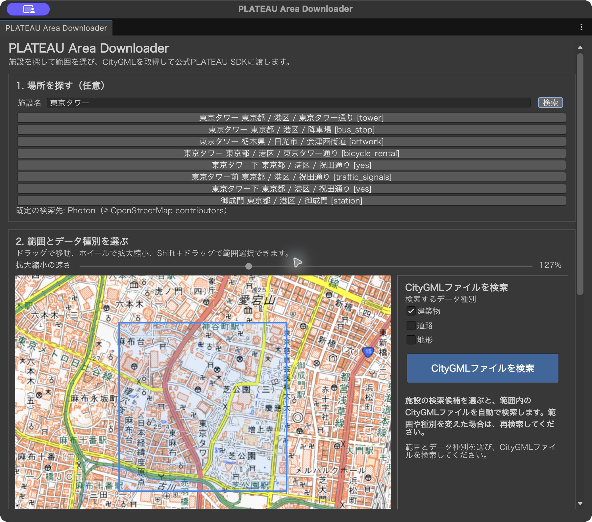
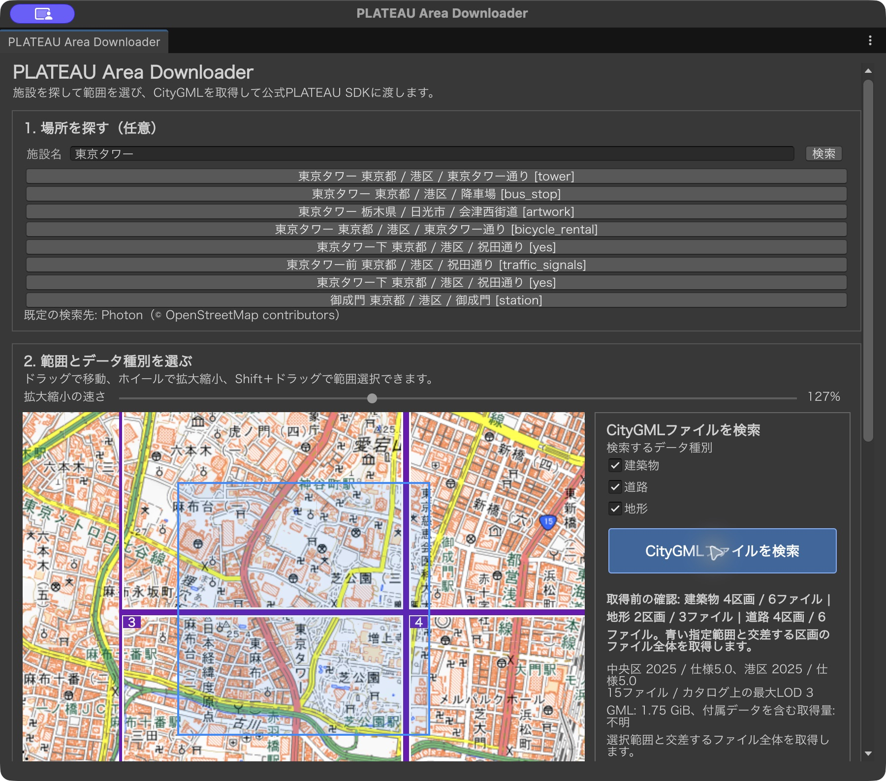
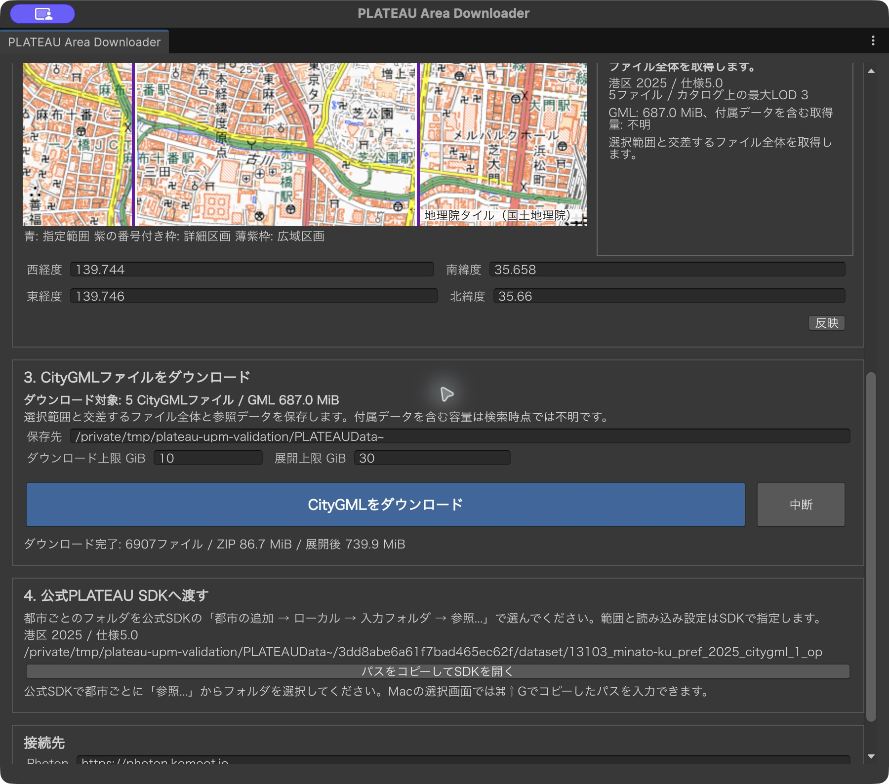
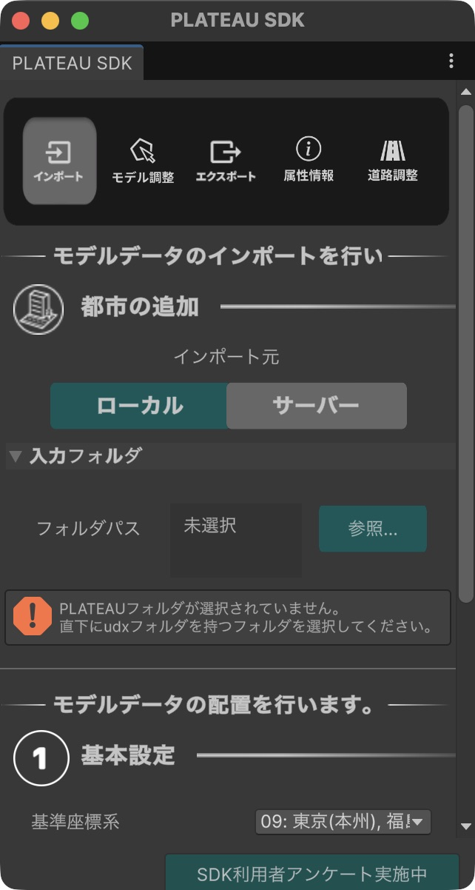
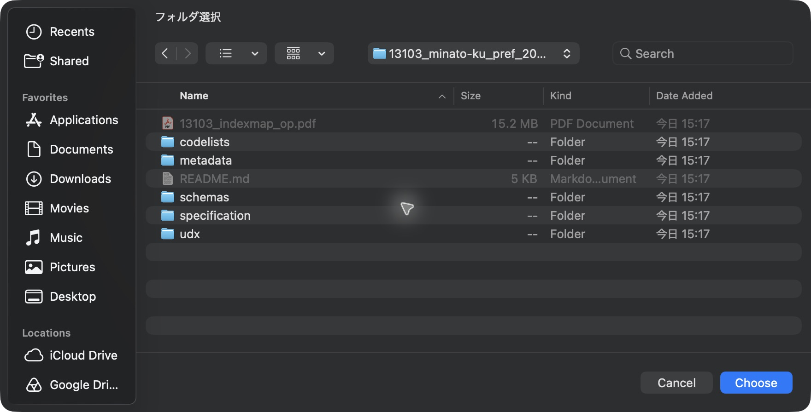
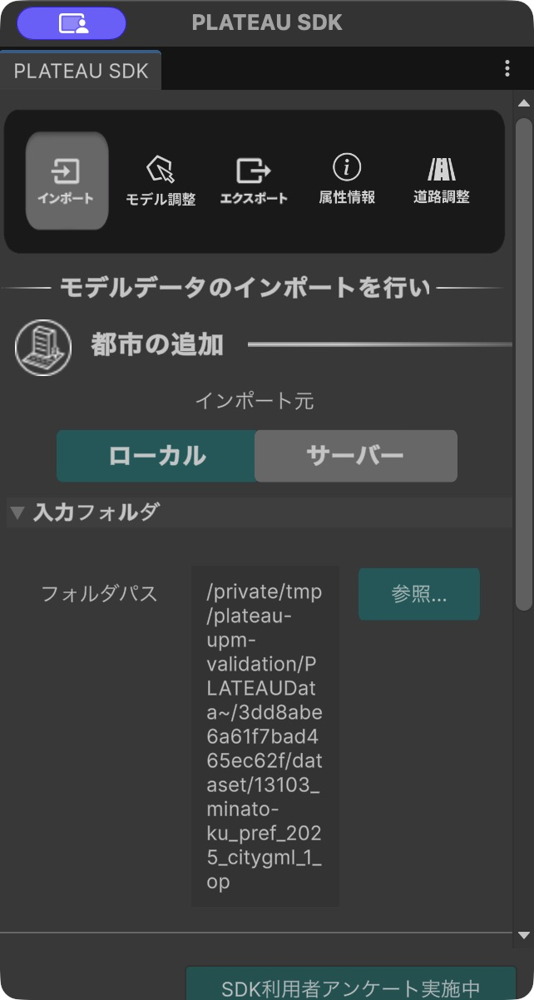

# 使い方：場所を選び、CityGMLを公式SDKへ渡す

PLATEAU Area Downloader は、指定した範囲に対応する CityGML と参照データをダウンロードし、公式 PLATEAU SDK for Unity で選べる都市フォルダを表示します。読み込み条件の指定とインポートは公式 SDK で行います。

このページの画面は、macOS、Unity 6000.3.10f1、PLATEAU SDK 4.3.0 で東京タワー周辺を操作した例です。検索結果の区画数・ファイル数・容量は場所や公開データによって変わります。[導入方法と動作環境](../README.md#2-必要な環境)も確認してください。

## 操作動画

[実際の画面操作を見る（MP4）](media/area-downloader-demo.mp4)



動画は、施設検索、種類の選択、経緯度の手入力、検索、保存済みデータの照合、SDK での都市フォルダ指定を記録したものです。待ち時間を短くするため、場面の間をカットしています。最初の広い範囲では 15 CityGML ファイルが見つかり、その後で経緯度を入力して範囲を縮め、再検索した結果は 5 CityGML ファイルです。ダウンロードの場面では、すでに取得済みのデータをサイズと SHA-256 で再照合しており、新規のネットワーク転送を撮影したものではありません。音声はありません。

## 1. 場所を探す

Unity の **Tools → PLATEAU Area Downloader** を開きます。施設名を入力して **検索** を押し、住所や種別を見て目的の候補を選びます。同名の施設が別の場所にある場合もあるので、候補の所在地を確認してください。候補を選ぶと、地図が移動し、最初に選択されているデータ種別で CityGML の検索も始まります。施設名を使わずに地図や経緯度から始めることもできます。


画面例：候補を選ぶ前。施設検索の出典は Photon / © OpenStreetMap contributors、背景地図は地理院タイル（国土地理院）です。

## 2. 範囲とデータ種別を選ぶ

地図をドラッグすると移動し、ホイールまたはトラックパッドの縦スクロールで拡大縮小します。**拡大縮小の速さ**は端末に合わせて調整できます。**Shift＋ドラッグ**で青い指定範囲を描きます。経緯度を直接編集した場合は **反映** を押してください。

地図の右側で **建築物・道路・地形**を選び、**CityGMLファイルを検索**を押します。範囲または種類を変更した後は、もう一度押して結果を更新してください。



画面例：青い枠が指定範囲、紫の番号付き枠が検索で見つかった詳細区画、薄紫の枠が広域区画です。右側の **取得前の確認** に種類ごとの「区画 / ファイル」を表示します。施設を囲む青い範囲が小さくても、複数の区画と交差することがあります。紫の枠とファイル数をダウンロード前に確認してください。画面は建築物 4 区画 / 6 ファイルなどが見つかった例です。背景地図：地理院タイル（国土地理院）。

検索対象は、**青い範囲と交差するファイル全体**です。データが青い枠で切り抜かれるわけではありません。右側の件数と下側の容量表示を確認し、必要なら範囲を狭めるか種類を減らして再検索します。

## 3. CityGMLをダウンロードする

検索結果を確認し、**CityGMLをダウンロード**を押します。**保存先**と転送量・展開後容量の上限を先に確認してください。表示される GML 容量には参照画像などが含まれず、最終的な取得量は検索時点では不明です。

進捗欄には「ZIP を取得中」「ZIP を展開・ファイルを記録中」「展開済み CityGML の参照先を確認中」「保存済みファイルのサイズと SHA-256 を照合中」「取得記録を確定中」などの作業を表示します。転送・展開が終わっても、その後の参照・整合性確認が完了するまで待ってください。再実行時は保存済みデータを照合して再利用します。



画面例：前の図より範囲を縮めて再検索し、港区の 5 CityGML ファイルと関連データを含む 6,907 ファイルを確認した状態。数値と保存先は撮影時の例です。背景地図：地理院タイル（国土地理院）。

## 4. 公式 PLATEAU SDK に都市フォルダを指定する

ダウンロード完了後、**4. 公式PLATEAU SDKへ渡す**の都市名の下にある **パスをコピーしてSDKを開く**を押します。都市が複数ある場合は、使う都市のボタンを選びます。この操作で都市フォルダのパスがコピーされ、公式 SDK の画面が開きます。インポートは始まりません。

公式 SDK の **インポート → 都市の追加 → ローカル → 入力フォルダ → 参照...**を開きます。



Mac のフォルダ選択画面では **⌘⇧G** を押し、コピーされたパスを貼り付けて Return を押します。表示されたフォルダに `udx` が**直下**にあることを確認し、**Choose**を押します。Windows ではフォルダ選択画面のアドレス欄にパスを貼り付けて移動できますが、Windows 実機での操作は未検証です。



選ぶフォルダの構造は次のとおりです。`dataset` 全体や `udx` 自体を選ばないでください。

```text
PLATEAUData~/
└── <job-id>/
    └── dataset/
        └── <city-folder>/  ← このフォルダを選ぶ
            ├── udx/
            ├── codelists/
            └── metadata/
```



ここで本ツールからの受け渡しは完了です。次に使う座標系、LOD、対象メッシュ、テクスチャなどを公式 SDK 側で選んでから、公式 SDK の手順でインポートしてください。[公式 SDK の都市モデル読み込み手順](https://github.com/Project-PLATEAU/PLATEAU-SDK-for-Unity/blob/main/Documentation~/manual/ImportCityModels.md)も参照できます。

## 迷ったとき

- 欲しい区画が足りない場合：青い指定範囲を見直して再検索し、紫の区画と種類別の件数を確認します。
- ダウンロードが長く見える場合：進捗欄の文言で、転送・展開・参照先確認・ハッシュ照合のどの作業中か確認します。
- SDK がフォルダを受け付けない場合：選択した都市フォルダの直下に `udx` があるか確認します。

画面画像と動画の撮影・編集内容、地図と検索結果の出典は[メディアについて](media/README.md)と[第三者サービスとデータ](../THIRD_PARTY_NOTICES.md)にまとめています。
